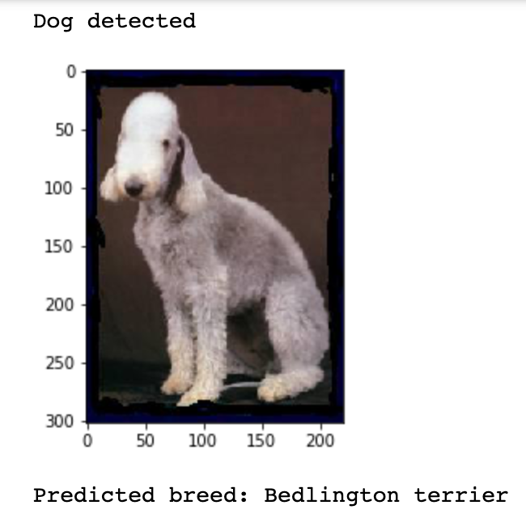
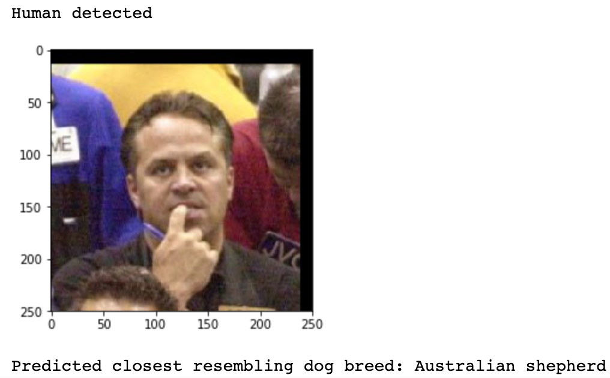

## Dog-breed-classifier using Convolutional Neural Network in PyTorch
Repository of Dog breed classifier project as a part of Udacity ML Nanodegree. 

### Overview

The goal is to build a ML model that can be implemented as a web application to process a real world image given as input and do the following

<ul>
<li>Detect if a dog is in the image, if yes predict the breed</li>
<li>Detect if a human face is in the image, if yes predict the closest resembling breed</li>
</ul>

The above goal is achieved in two ways

<ul>
<li>Building a CNN model from scratch using the images provided for training.</li>
<li>Using transfer learning, where a pretrained model is downloaded and used.</li>
</ul>

### Dataset

[Dog dataset](https://s3-us-west-1.amazonaws.com/udacity-aind/dog-project/dogImages.zip) 
[Human dataset](https://s3-us-west-1.amazonaws.com/udacity-aind/dog-project/lfw.zip) 

### CNN model built from scratch

Built a CNN model from scratch to solve the problem. The model has 3
convolutional layers. All convolutional layers have kernel size of 3 and stride 1. The
first conv layer takes the input image with size 224*224 and the final conv layer
produces an output size of 256. ReLU activation function is used. The
pooling layer of (2,2) is used which will reduce the input size by 2. We have two
fully connected layers that finally produces 133-dimensional output. A dropout of
0.3 is added to avoid over overfitting.

### Refinement - CNN model created with transfer learning

The CNN created from scratch have accuracy of 14% which crosses the threshold set i.e 10%. To create <b>CNN with transfer learning</b>, <b>Resnet101 architecture</b> was selected
which is pre-trained on ImageNet dataset, and is 101 layers deep. A fully connected layer is added to produce 133-dimensional output (one for each breed). The model performed well compared to CNN model built from scratch. With 10 epochs, the model yields 82% accuracy.

### Model Evaluation

The CNN model created using transfer learning with
ResNet101 architecture was trained for 10 epochs, and the final model produced an
accuracy of 82% on test data. The model correctly predicted breeds for 686 images out of 836 total images.

**Accuracy on test data: 82% (686/836)**

### Sample Outputs

 
 

